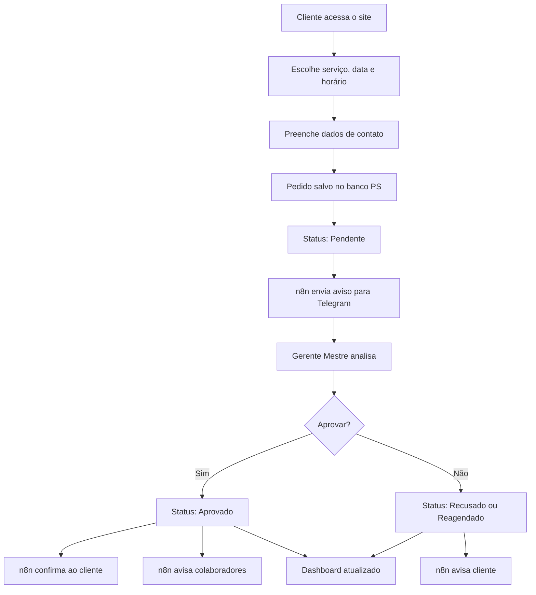

# Projeto: Site com Agendamento Online, Aprovação Gerencial e Integração n8n + Banco PS

## 1. Objetivo do Projeto

Criar um site com sistema de **agendamento online**, onde o cliente possa escolher um serviço, data e horário disponível. Cada pedido de agendamento será registrado no banco de dados **PS**, enviado para análise do **Usuário Mestre/Gerente**, compartilhado em um **grupo de Telegram** e, após aprovação, confirmado ao cliente pelos canais disponíveis: tela do site, e-mail, WhatsApp ou Telegram.

O sistema será integrado ao **n8n**, já instalado na VPS, para automatizar notificações, confirmações, registros e fluxos de comunicação entre cliente, gerente e colaboradores.

---

## 2. Estrutura Geral do Sistema

O sistema será composto por:

- Site com página de agendamento online;
- Área exclusiva para cadastro e login de clientes;
- Painel administrativo para o Usuário Mestre/Gerente;
- Banco de dados **PS** como base central de informações;
- Integração com **n8n** para automações;
- Integração com **Telegram** para avisos em grupo;
- Dashboard com visão dos serviços agendados;
- Controle de funcionamento por dias e horários definidos;
- Compartilhamento dos serviços agendados com colaboradores;
- Confirmação automática ao cliente após aprovação.

---

## 3. Perfis de Usuário

### 3.1 Cliente

O cliente poderá:

- Acessar o site;
- Criar cadastro ou solicitar agendamento de forma simplificada;
- Escolher o serviço desejado;
- Selecionar data e horário disponível;
- Informar nome, telefone, e-mail, WhatsApp ou Telegram;
- Receber aviso de que o pedido foi recebido;
- Receber confirmação após aprovação do gerente;
- Consultar seus próprios agendamentos, caso tenha área de login.

### 3.2 Usuário Mestre / Gerente

O Usuário Mestre será responsável por:

- Controlar os agendamentos recebidos;
- Aprovar, recusar ou reagendar solicitações;
- Visualizar todos os dados dos clientes e serviços;
- Definir dias e horários de funcionamento;
- Cadastrar serviços disponíveis;
- Cadastrar colaboradores;
- Compartilhar agendamentos aprovados com a equipe;
- Acompanhar o dashboard administrativo;
- Receber notificações via Telegram.

### 3.3 Colaboradores

Os colaboradores poderão receber informações dos serviços agendados, como:

- Nome do cliente;
- Serviço solicitado;
- Data;
- Horário;
- Local;
- Observações do atendimento;
- Status do agendamento.

O acesso dos colaboradores pode ser limitado apenas aos serviços atribuídos a eles.

---

## 4. Fluxo Principal do Agendamento

### 4.1 Pedido feito pelo cliente no site

1. O cliente acessa a página de agendamento.
2. Escolhe o tipo de serviço.
3. Seleciona data e horário disponível.
4. Preenche os dados de contato.
5. Confirma o pedido.
6. O site registra a solicitação no banco PS com status inicial: **Pendente de Aprovação**.
7. O site exibe na tela a mensagem:

> Seu pedido de agendamento foi recebido com sucesso. Aguarde a confirmação do responsável.

---

## 5. Status dos Agendamentos

O sistema deverá trabalhar com os seguintes status:

| Status | Descrição |
|---|---|
| Pendente | Pedido recebido, aguardando aprovação do gerente |
| Aprovado | Agendamento confirmado pelo gerente |
| Recusado | Pedido não aprovado |
| Reagendado | Horário ou data alterados pelo gerente |
| Cancelado | Agendamento cancelado pelo cliente ou gerente |
| Concluído | Serviço realizado |
| Não compareceu | Cliente não compareceu ao atendimento |

---

## 6. Regras de Funcionamento

O sistema deverá respeitar os dias e horários cadastrados pelo Usuário Mestre.

Exemplo:

- Segunda a sexta-feira: 08h às 18h;
- Sábado: 08h às 12h;
- Domingo: fechado;
- Feriados: bloqueados manualmente pelo gerente;
- Intervalos de almoço ou pausa: bloqueados no calendário;
- Limite de atendimentos por horário configurável.

O cliente só poderá escolher horários disponíveis dentro da agenda oficial do site.

---

## 7. Agenda do Site

A agenda do site será alimentada por todos os pedidos de agendamento.

Cada agendamento deverá conter:

- ID do agendamento;
- Nome do cliente;
- Telefone;
- E-mail;
- WhatsApp;
- Telegram;
- Serviço solicitado;
- Data;
- Hora;
- Local;
- Observações;
- Status;
- Responsável pela aprovação;
- Colaborador vinculado;
- Data de criação;
- Data de aprovação;
- Histórico de alterações.

---

## 8. Banco de Dados PS

O banco de dados **PS** será usado como base principal do sistema.

### 8.1 Tabelas sugeridas

#### clientes

Campos sugeridos:

- id_cliente;
- nome;
- email;
- telefone;
- whatsapp;
- telegram;
- documento, se necessário;
- endereço;
- data_cadastro;
- status_cliente.

#### servicos

Campos sugeridos:

- id_servico;
- nome_servico;
- descricao;
- duracao_media;
- valor_referencia, se aplicável;
- local_atendimento;
- status_servico.

#### agendamentos

Campos sugeridos:

- id_agendamento;
- id_cliente;
- id_servico;
- id_colaborador;
- data_agendada;
- hora_agendada;
- local;
- status;
- observacoes_cliente;
- observacoes_gerente;
- criado_em;
- aprovado_em;
- aprovado_por.

#### colaboradores

Campos sugeridos:

- id_colaborador;
- nome;
- email;
- telefone;
- telegram;
- tipo_servico;
- status_colaborador.

#### funcionamento

Campos sugeridos:

- id_funcionamento;
- dia_semana;
- hora_inicio;
- hora_fim;
- intervalo_inicio;
- intervalo_fim;
- ativo.

#### notificacoes

Campos sugeridos:

- id_notificacao;
- id_agendamento;
- canal;
- destinatario;
- mensagem;
- status_envio;
- enviado_em.

---

## 9. Integração com n8n

O **n8n** será responsável pelas automações do sistema.

### 9.1 Fluxo 1 — Novo pedido de agendamento

Gatilho:

- Novo registro criado na tabela de agendamentos;
- Ou webhook enviado pelo formulário do site.

Ações:

1. Registrar pedido no banco PS;
2. Enviar aviso para o grupo de Telegram;
3. Notificar o Usuário Mestre;
4. Exibir confirmação na tela do site;
5. Enviar aviso inicial ao cliente, se houver contato informado.

Mensagem sugerida para o Telegram:

```text
📅 Novo pedido de agendamento recebido

Cliente: {{nome_cliente}}
Serviço: {{servico}}
Data: {{data}}
Hora: {{hora}}
Local: {{local}}
Status: Pendente de aprovação

Aguardando análise do gerente mestre.
```

---

### 9.2 Fluxo 2 — Aprovação do agendamento

Gatilho:

- Usuário Mestre altera o status para **Aprovado** no painel.

Ações:

1. Atualizar status no banco PS;
2. Registrar data e usuário da aprovação;
3. Enviar confirmação ao cliente;
4. Enviar aviso ao grupo de Telegram;
5. Compartilhar o agendamento com o colaborador responsável;
6. Atualizar dashboard.

Mensagem sugerida para o cliente:

```text
✅ Agendamento confirmado

Olá, {{nome_cliente}}.
Seu agendamento foi aprovado com sucesso.

Serviço: {{servico}}
Data: {{data}}
Hora: {{hora}}
Local: {{local}}

Obrigado. Aguardamos você no horário marcado.
```

---

### 9.3 Fluxo 3 — Recusa ou reagendamento

Gatilho:

- Usuário Mestre altera o status para **Recusado** ou **Reagendado**.

Ações:

1. Atualizar status no banco PS;
2. Registrar justificativa ou observação;
3. Notificar cliente;
4. Notificar grupo de Telegram;
5. Liberar ou bloquear novo horário na agenda.

---

## 10. Telegram

Será criado um grupo exclusivo para agendamentos.

Exemplo de nome:

```text
Agendamentos - Nome do Site
```

O grupo receberá:

- Novo pedido de agendamento;
- Aprovação do gerente;
- Recusa ou reagendamento;
- Cancelamentos;
- Lembretes de agenda do dia;
- Resumo diário dos atendimentos.

---

## 11. Notificações para o Cliente

O cliente poderá ser avisado pelos canais informados no cadastro ou formulário:

- Tela do site;
- E-mail;
- WhatsApp;
- Telegram.

### 11.1 Mensagem na tela após pedido

```text
Pedido recebido com sucesso!
Seu agendamento foi enviado para análise.
Você receberá a confirmação após aprovação do responsável.
```

### 11.2 Mensagem após aprovação

```text
Seu agendamento foi aprovado.
Data: {{data}}
Hora: {{hora}}
Local: {{local}}
Serviço: {{servico}}
```

---

## 12. Dashboard Administrativo

O dashboard do Usuário Mestre deverá apresentar:

- Total de agendamentos do dia;
- Total de agendamentos pendentes;
- Total de agendamentos aprovados;
- Total de cancelados;
- Próximos atendimentos;
- Serviços mais solicitados;
- Clientes cadastrados;
- Colaboradores vinculados;
- Histórico de atendimentos;
- Filtro por data, serviço, status e colaborador.

---

## 13. Área Exclusiva do Cliente

A área do cliente poderá conter:

- Cadastro/login;
- Dados pessoais;
- Histórico de agendamentos;
- Status dos pedidos;
- Opção para solicitar novo agendamento;
- Canal de contato;
- Atualização de e-mail, WhatsApp ou Telegram.

---

## 14. Área do Gerente Mestre

A área administrativa deverá conter:

- Login seguro;
- Listagem de agendamentos;
- Botões para aprovar, recusar, reagendar ou cancelar;
- Cadastro de serviços;
- Cadastro de colaboradores;
- Cadastro de horários de funcionamento;
- Bloqueio de datas específicas;
- Dashboard geral;
- Histórico de ações;
- Controle de permissões.

---

## 15. Segurança e Controle

Recomendações:

- Login com senha forte para o gerente;
- Controle de permissões por tipo de usuário;
- Registro de logs de aprovação e alteração;
- Proteção contra horários duplicados;
- Validação de e-mail e telefone;
- Backup automático do banco PS;
- Uso de HTTPS no site;
- Proteção dos webhooks do n8n com token secreto;
- Limite de tentativas de login.

---

## 16. Regras para Evitar Conflitos de Agenda

O sistema deverá validar:

- Se o horário está dentro do funcionamento do site;
- Se o horário já foi ocupado;
- Se o serviço exige tempo específico;
- Se o colaborador está disponível;
- Se há limite máximo de atendimentos por horário;
- Se a data não está bloqueada;
- Se o agendamento ainda está pendente ou aprovado.

---

## 17. Fluxo Resumido do Sistema



---

## 18. Prioridades de Implantação

### Fase 1 — Base do sistema

- Criar estrutura do banco PS;
- Criar formulário de agendamento no site;
- Registrar pedidos no banco;
- Criar painel simples para o gerente;
- Criar status de agendamento.

### Fase 2 — Automação com n8n

- Criar webhook de novo agendamento;
- Enviar aviso para Telegram;
- Enviar confirmação inicial ao cliente;
- Criar fluxo de aprovação;
- Criar fluxo de confirmação final.

### Fase 3 — Dashboard

- Criar painel com indicadores;
- Criar filtros por data, serviço e status;
- Criar visão diária e semanal;
- Criar resumo para o gerente.

### Fase 4 — Área do cliente

- Criar cadastro/login;
- Criar histórico de agendamentos;
- Criar atualização de dados;
- Criar consulta de status.

### Fase 5 — Colaboradores

- Criar cadastro de colaboradores;
- Vincular colaborador ao serviço;
- Compartilhar agendamento aprovado;
- Criar visão individual por colaborador.

---

## 19. Resultado Esperado

Ao final da implantação, o site terá um sistema completo de agendamento online, com controle administrativo, aprovação pelo gerente mestre, banco de dados centralizado, automação via n8n, notificações por Telegram e confirmação ao cliente pelos canais disponíveis.

O sistema permitirá melhor organização dos serviços, redução de falhas de comunicação, controle da agenda e acompanhamento profissional dos atendimentos realizados.

---

## 20. Observação Final

Este projeto será desenvolvido aproveitando a infraestrutura já existente na VPS, utilizando o n8n instalado e o banco de dados PS como base central. A proposta é criar um sistema simples, funcional, escalável e preparado para futuras integrações com WhatsApp, e-mail, Telegram, CRM e outros módulos da IA Guru.
